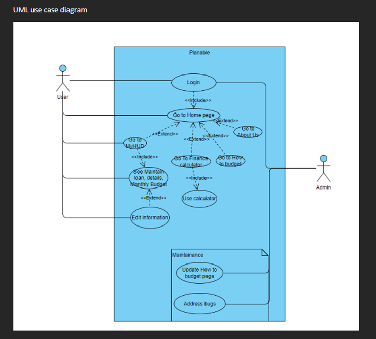
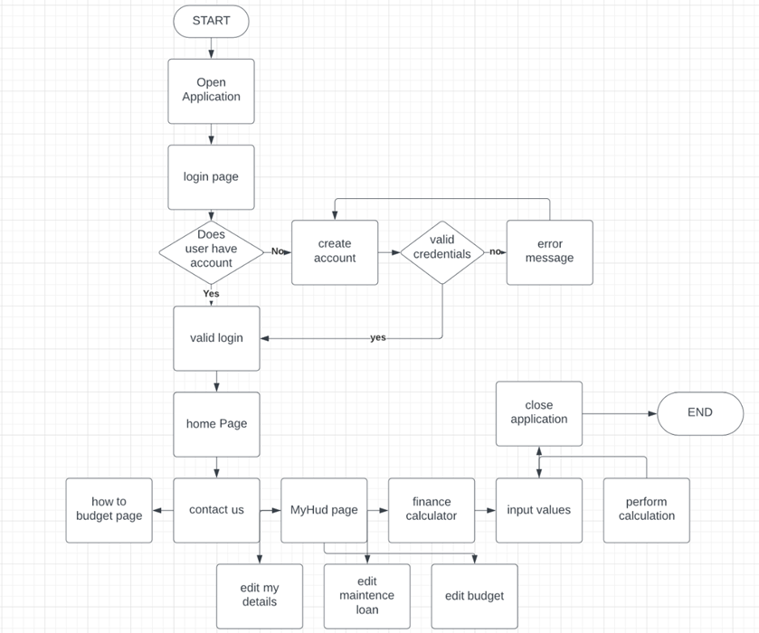
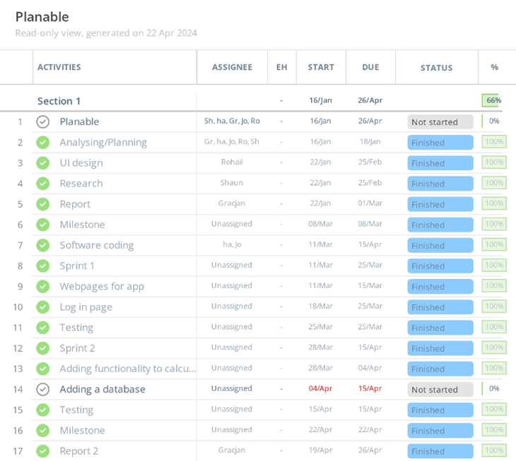
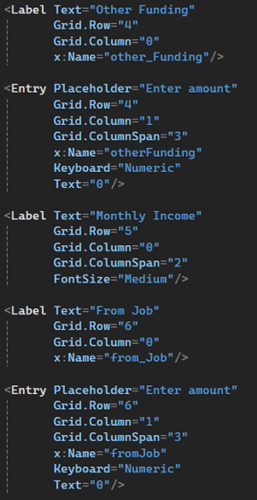
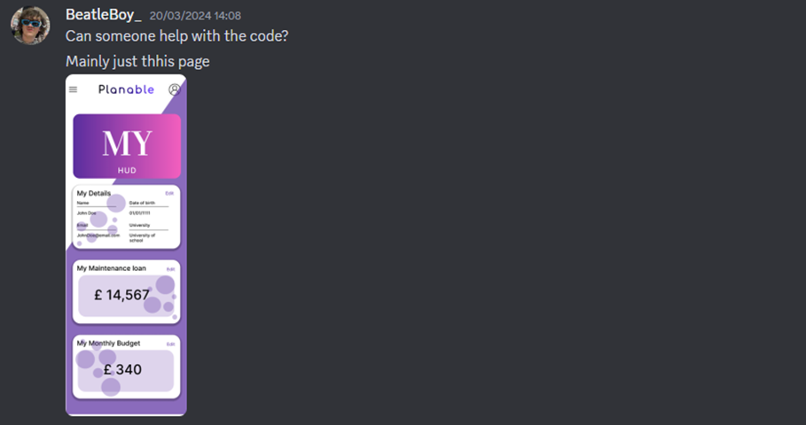

# Planable group report 2
## Team members:
Harry Atkinson
Joshua ********
Rohil ***
Shaun *********
Gracjan ******

## 1. Introduction
The environment for students, such as financing and money management can be very harsh, as typically everything can be very expensive, with the increasing financial problems in the UK, and lack of employment for students, means many students struggle with money as according to Savethestudent.org (Brown, 2022) 82% of students worry about handling their finances, this is partially to do with them not understand the importance of saving and losing track of their spending. Keeping spending, and finances can be a challenge for many students, with many apps to choose from, it can get quite daunting. To combat this, we propose Planable.

Planable streamlines and simplifies this process as a free-to-download application, on android and windows, aiming to provide students with a simple, peace of mind way to track their finances and their spending habits to give students infographics and information regarding their spending, which can promote better habits, and show students what they spend their money on the most, and have an overview of student finances, so they can better plan for the future, with tips and infographics on how to save money. However, it’s open to all demographics, and not limited to only students. Planable should have multiple features such as; functioning log in page to prevent any unauthorised access to peoples account, a way for users to enter their incoming and outgoings and successfully calculate their budget, a home/portal page which allows for the user to easily navigate to other pages of the application, there should be a page that has away for users to contact the group via email and/or phone, a page informing the user how to budget, a database linked to store user name and passwords, as well as a page that gives the users an overview of their financial information and their budget.

## 2. Technology used.

Initial Design software
The time plan was created using Instagantt (5Rabbits LLC, 2023), this decision was made as Instagantt is a free software and easily accessible as it was online, being free and online allowed everyone within the project to access the time plan to make any changed if needed. When looking for software to create the time plan every option available has the same features so there wasn't anything better to use. 
Canva (Canva, 2024) was used during our project to create the wireframes and the images on the home page. Canva (Canva, 2024) was chosen as it’s free and online, it being online allowed for the work to be accessed anywhere anytime and stores the work online reducing the risk of accidental work loss. Although, photoshop (Adobe, 2024) is better it’s locked behind a paywall and with the free tools the price isn’t worth it.
Harry created a prototype of the application in MAUI using .XAML. This prototype had limited function and was made to fit the wireframes as closely as possible. It allowed Harry to practise with XAML before developing the application.

## MAUI
Our project was developed in a .NET framework called MAUI; this framework is used to develop applications across multiple platforms simultaneously. This is a powerful yet complex tool which can save a lot of time when used correctly. To develop an application in MAUI we needed to know the language C# and XAML. C# is a relatively easy language to learn and is a widely used object orientated language. However, XAML was more difficult to learn as none of the developers had much background in scripting languages, we used the visual studio ide to develop our app MAUI was developed to work the best in it. In hindsight it would have been better to develop the application in a framework such as react as it’s more supported and with MAUI being relatively new there would be less bugs as well as more users generated content such as libraries to perform simple tasks. However, MAUI being a Microsoft application means it has long term support so we can use it to develop our app in the long-term as well as having in-depth documentation to aid in development which was extremely useful during development. Overall, we would have still benefited developing our application in Java based language as its more known among the members of our group.
## 3. Development methods
### Development style
During the development of the project, we were inspired by the ‘Agile’ methodology. Although, we didn’t follow this perfectly we utilised the main structure of it and tried to split the development into sprints. This was good for the most part as it allowed for the application to be flexible as during each sprint, we were able to go back to the plan and develop stage, furthermore we always had working iteration of the application allowing for testing during each part of the application.
### Project planning
   
The project plan illustrates how we used agile to deliver workloads in short sprints, the group believed this to be the most accurate way to streamline workflow while mainly working remotely. While developing in this method we had less stress in getting work done due to being able to utilise backtracking if an error arouses allowing us to mitigate the damage/risk as part of Agile is that you have a working prototype after each sprint. To create this time plan we decomposed the project into sprints each sprint contained a do able chunk of the project in the certain time frame.
### MoSCow 
#### Must Have
The application must provide users with an accurate budget calculated from inputted incomings and outgoings and a login page to prevent unauthorised users from accessing their accounts.
#### Should Have
The application should have a neatly laid out home/portal page which will allow users to navigate between all the pages of the application, it also should have a page that gives the users a break down of their financial status including their weekly budget.
#### Could Have
The application could have a page that informs the users on how to budget themselves with a few key steps explaining it and a page that allows the users to contact the team for any enquiries via email or phone number.
#### Will Not Have
The application will not require any sensitive information such as banking information and will not provide unauthorised users access to any information that users have inputted into the application such as monthly income and outgoing, or the weekly budget that the application calculates.

### Diagrams
    
  
  
### UI designs 
Rohil designed all the wire frame models and prototype models for our application during the analysis/planning stage these prototype design images allow us to provide the users with effective imagery on what the final product will look like, this shows the user what type of visual benefits the application will provide:

   
**Figure 1**
 
**Figure 2**
 	
**Figure 3**
 
**Figure 4**
 
**Figure 5**
 
**Figure 6**
Once we created the logo we decided to stick with the purple and white theme which allows a modern and crisp look to our prototype UIs. We have included quality of life features such as a NAV bar shown in figure 6 and a remember me option to automatically log users in once they load the application again.
Figure 1 shows the main page, which is intended to be a ‘portal page’ this allows the user to access all the parts of the application. This page is designed to be simple to avoid clutter which allows the user to easily navigate our application.
There is a page that gives the user information on how to budget, this is necessary when creating an application aimed toward student budgeting, shown in Figure 2. 
The application has a finance calculator shown in figure 4 which lets you enter your finances such as monthly from a job and the amount from student finance each term, once all the details have been entered the student is told important information regarding if they are spending too much or if they have sufficient funds to support them.
We have included an about us section which allows the user to learn about us which allows the user to have peace of mind when allowing us insight into their financial information we believe that having a trusted relationship with the user is required to run an app such as this, the page contains contact information such as an email and a phone number, shown in figure 3 which allows for users to contact the team if they have any problems or enquires.
## 4. Problems encountered.
### Overall Project Management
The start of the project the overall management was good as the roles were distributed fairly and the group got on with the work. When we had to make the poster, the management had declined as the team leader kept on putting off the creation of the poster leading to Harry creating it, the same happened with the PowerPoint presentation which was completed by Harry and Josh to help. The team leader would tell Harry to develop the application, where Harry would ask Josh for help with it where he created the login page and when asked to do more, he said he would and never did leaving Harry to develop the rest of the application. When mentioned to the team leader, he shrugged it off. The management of the team got worse during the creation of report 1 as the team leader said he would do the report and refused to give any follow-up when asked to show the document or if he needed any help. There was a decline in attendance to meetings as Rohil and Shaun wouldn’t show up. 4 hours before the deadline the team leader messages the group chat saying he had gone on a “night out” and therefore couldn’t finish or upload the document, this left Harry to drop his plans and do what he could with the document. At this point the project was not moving at all as the team leader wouldn’t delegate work the team, so Harry decided to take over for the group report 2, he created a layout of the document including headers and bullet point of what was needed in each section and sent the document to the group and requested for them to pick a section to work on. However, none of the team responded beside Josh, so Harry decided that instead of asking he would just give the team parts of the document, this worked as Josh and Rohil both completed their sections. However, the team leader wouldn’t start his until the week of the deadline as well as Shaun. This all resulted in the application being uncomplete and missing the plan to add database integration into the app. Overall, the management of the project was mediocre at best as the team leader relied on the other members of the team to complete the work while putting off his work and leaving it all to the last minute.

### Technical issues 
During the development of our application there was several issues that arouse from both front end and back end.
#### Front-end issues
The issues regarding to front end are as follows:

| Issue number  | Issue         | solution|
|:-------------:|:-------------:|:-------:|
| 1             | During the development Harry couldn’t get the backgrounds to follow the pattern of the backgrounds in the original UI designs. This issue was caused by both a lack of knowledge of MAUI as well as lack of documentation. | Harry proposed for the background to be a singular colour, the group then trialled different colours where we decided to use a light grey as it allows text to be read easily and gave the app more colour than just white. |
| 2             | While adding images into the app Josh found an issue where the images would not link from the resources folder.      |   We couldn’t find the source of this issue; we were able to create a work around by changing the to the final image in the prototype. |

#### Back-end issues
The issues regarding to back end are as follows:

| Issue number  | Issue                             | solution                          |
|:-------------:|:----------------------------------|:----------------------------------|
| 1             | During the creation of the login page Harry ran into trouble with reading passwords from a file. This was caused from a lack of knowledge of how MAUI handled files. | Harry used the documentation from Microsoft (Birtch, et all, 2023) as well as W3Schools C# tutorials (W3Schools, 1999-2024). |
| 2             | Navigating between pages caused issues for Harry due to gaps of understanding how MAUI worked. | Harry used the Microsoft documentation as well as videos from Microsoft (Birtch, et all, 2023) to learn how MAUI handled pages as well as the navigation between them. The issue was from the pages not being registered in the root page. |
| 3             | Harry had an issue where he was unable to get the login page to be the first page the user sees; this issue was caused by a change in the design where the group thought it would be better for the page to appear first. This caused an issue where main page was always initialized first instead of the login page. | Harry solved this by forcing the Main page to create a new instance of the login page as a pop up preventing the user from interacting with the main page until the user logged in or created a new account. |
	
## 5. UML diagram

 
**Figure 1**
Figure 1 shows the User class this is the standard class for an ordinary user, it contains all the attributes and methods of the class. It also shows the admin user class this class inherits from the User class while adding attributes such as admin username and password, it adds the checkAdmin method which allows the software to check if the user is an admin. 
 
**Figure 2**
Figure 2 represents the pages of the application and presents their direct dependency to the content page class. This class is a built-in class to MAUI which is used to create pages that will display content, all the pages that are used in the project are directly dependent on the content page class. 
 
**Figure 3**
Figure 3 shows that the MainPage class implements the other pages. This is due to the main page acting as a ‘portal’ to all the other pages.

### Testing
#### White box

| Test          | Name           | Evaluation|
|:-------------:|:--------------:|:---------:|
| Login page    | Harry Atkinson |  |

| Test              | Name                  | Evaluation                             |
|:---------------  :|:----------------------|:---------------------------------------|
| Login page        | Harry Atkinson        | The login page functions as it should. It opens and reads the file, then compares the user input to the file and returns true if the input is equal to the file and false if it isn’t prompting the user to try again. |
| Budget calculator | Harry Atkinson        | The weekly budget that was being calculated didn’t make logical sense as it shows spending more than you have weekly. Looking at the code I found that there is a logic error where it’s giving the budget out monthly this has been fixed by dividing the value by four for the average month. |
| Home/Main page    | Harry Atkinson        | While testing the home page it seemed to work correctly as each button appeared and functioned as they should by taking the user to the correct page. |

#### Black box

| Test              | Name                  | Evaluation                             |
|:---------------  :|:----------------------|:---------------------------------------|
| Login page        | Kaitlyn Y****         |  The login pages layout is clear and concise and therefore isn’t difficult to navigate. I think that the “Remember Me” and “Forgot Password” should be placed below or above each other so there is spacing between them. |
| Budget calculator | Kaitlyn Y****         | The calculator works, with useful information with total monthly income, outgoings and what my weekly budget would be. The input for the page is clear making it user friendly. Where it provides information on the weekly budget, there is no spacing between “Your weekly budget is £---” and “Your maintenance…” This could benefit with a space to make it clearer. |
| Home/Main page    | Kaitlyn Y****         | The main page is well laid out, with the different sections of the app being presented clearly, with relevant images for each of the sections. The top menu opens smoothly with the sections again being clearly labelled. While the three lines are clear to me, it could benefit from a greater contradicting colour from the background to make it that much clearer.  |

## 6. Team
### Roles & Skills

| Name            | Role        | Skills                   | Self Evaluation              |
|:---------------:|:------------|:-------------------------|:-----------------------------|
| Harry Atkinson  | Developer   | Harry has had experience in project work and management from his engineering BTEC degree he also knows a range of programming languages such as C#, python, and Java. This allowed lots of options for how the app could be developed. When MAUI was chosen to develop Planable Harry’s previous experience with C# and understanding object orientated programming techniques allowed him to learn MAUI and XAML easier. | I have learnt the new .net framework MAUI. This will benefit me in the long term as it has the potential to become an industry standard and has also allowed me to learn about developing in both backend and frontend. I have improved my ability to work as a team by delegating tasks out to each member equally and fairly as overtime I have had to step into the role of team leader and manage the team members as well as the distribution and completion of work. Overall, this project could have gone better with a more thorough and in-depth time plan from the beginning to allow us to be on time with development and keep track at where we are and better team management by keeping the members of the group accountable for their short fallings. |
| Joshua A*****   | Developer   | I have previous experience with designing webpages using cs styling which helped me understand the basics when understanding XAML. I have also done project management work and units within my BTEC at college which helped me manage my workload within a group / team  | When developing this program, I have used the .NET Maui framework which may benefit me in the future when it becomes one of the many popular industry standard frameworks. I was completely new to this way of programming since I have never worked with apps, having to program an app was an obstacle I had to overcome and even though I didn't program the whole application the sections I did helped me understand the basics of the application  |
| Rohil A**       | Designer    | From developing projects in the past at my time in college and personal projects I have gained experience and knowledge in designing UI’s, coding in python, java, c, c++, using HTML/CSS and Additionally, I also have experience in project management from working on a project within a team and completing a project management module within college. | As the designer I needed to design the UI for each page of the app, this role required me to understand how apps are created and with my skills and experience having developed apps in the past I have the knowledge to understand what can be feasible when developing an app, this has helped me keep the UI design realistic for development making the developers work load reasonable within the given time frame for the project. There were instances where I struggled to use certain tools within the software I was using (Figma) however simple research on google allowed me to overcome this.  |
| Shaun A******** | Researcher  | I have previous experience in researching, which helped me to find most of the information that we needed for the project this includes the information for each page. Two examples are statistics and behaviours of our target audience. A skill that helped me a lot is paraphrasing which enabled me to take the main information from any long piece of writing. This was very effective in improving the quality and the quantity of what I researched. | Since I am assigned to research role, I had the opportunity to learn a lot about finances in the UK and how it younger people manage their finances. With my role I had less challenging and time-consuming tasks to complete, the benefit of this I can help my project mates with some tasks if they need or want it. With this I was able to do a few designing tasks and only a handful of programming tasks which helped me improve the skills that where transferable into my tasks like organisation, my planning, critical thinking, and analysis. In conclusion the whole project has been very smooth. |
| Gracjan B*****  | Team Leader | Prior to starting the project, I had worked with games development in a group in college, had worked with multiple programming languages and fluent with frameworks. This includes languages such as Java, C#, JavaScript, Python etc, using frameworks like MAUI and React Native. Considering I was in multiple leadership roles and are a solopreneur for a project I am working on alongside my studies, it bares resemblance to this project, which is why I have been appointed to team leader.  | I had introduced the team to C# and knew the best tools for the project using MAUI as we had already been learning Java, and it shows significant resemblance to C#, we wanted to all be familiar so we can all work together very effectively. I had steered the group into the right direction and evaluated the application code, documentation, and progress of the application, without me there would be a lot of deadlines that may have been missed, and confusion regarding what to develop and what tools to use to assist development.  |

## 7. Conclusion
To conclude we were able to create a working application to help students handle their money and budget efficiently with most objectives achieved such as the login page, the ability calculates the user’s budget, a page that includes a way to contact the group, and a well laid out home/portal page that allows the user to navigate the application efficiently. All this together enables the application to help students and other users calculate their budget and helps them save money easily and more efficiently. However, in the future we have plans to add more function to our application this includes and is not limited to adding extra security such as hashing algorithms for passwords to allow our application to be more secure, linking our application to a database to enable us to handle user data more efficiently and securely, integration to allow for us to track users spending without them having to input their spending this will make the data collected more accurate as it will reduce human input error as well as most human error in general. The overall group management went alright with the work being split up fairly and depending on the skill sets of the member of the group.
## References
Britch, Kelderman, George, D.B, O.K, A.G. Microsoft. (11/29/2023). File system helpers. Microsoft Learn. https://learn.microsoft.com/en-us/dotnet/maui/platform-integration/storage/file-system-helpers?view=net-maui-8.0&tabs=windows
W3Schools. (1999-2024). C# Files. W3Schools. https://www.w3schools.com/cs/cs_files.php
5Rabbits LLC. (2023). Gantt Chart Online Maker Software. Instagnatt. https://www.instagantt.com/?gad_source=1&gclid=EAIaIQobChMIgbmA8-vVhQMVgp1QBh2SCgjtEAAYASAAEgJG4vD_BwE
Canva. (2024). https://www.canva.com/en_gb/
Adobe. (2024). Photoshop. adobe. https://www.adobe.com/uk/products/photoshop/landpa.html?gclid=CjwKCAjwuJ2xBhA3EiwAMVjkVHWPvo_n7VUhlKconKa0w8r_iWrDwN_lbfzrmZ2I-oZreFdpnw4aDhoCwMcQAvD_BwE&mv=search&mv=search&mv2=paidsearch&sdid=2XBSBWBF&ef_id=CjwKCAjwuJ2xBhA3EiwAMVjkVHWPvo_n7VUhlKconKa0w8r_iWrDwN_lbfzrmZ2I-oZreFdpnw4aDhoCwMcQAvD_BwE:G:s&s_kwcid=AL!3085!3!441664377297!e!!g!!photoshop!1422700211!58647953511&gad_source=1
Brown, L.B. Save the student. (2022). Student Money Survey 2022 – Results. savethestudent.org. https://www.savethestudent.org/money/surveys/student-money-survey-2022-results.html

## Appendices

### Meeting minutes

| Date     | Topics covered        | Attendees                | Apologies |
|:--------:|:----------------------|:-------------------------|:----------|
| 14/03/24 | Created report 2 document as well as delegated out the sections between the members present; Harry is doing the problems encountered, Joshua is doing development methods, Gracjan is doing the merits and limitations of the technology used. | Harry, Gracjan, Joshua | N/A |
| 18/03/24 | Harry started working on the problems encountered section of the 2nd report, as well as debugging the code behind the app. | Harry, Gracjan, Joshua | N/A |
| 21/03/24 | Unrecorded | Unrecorded | Harry |
| 15/04/24 | We presented our application as part of the “Tech demo”. We discussed the group report 2 document as a group and got most of the team to fill out the roles and skills section. | Harry, Gracjan, Shaun, Rohil | Josh |
| 18/04/24 | Harry, made more progress on the group report finishing of the Development methods as well as doing work on the conclusion and adding the final photos of the app. | Harry, Gracjan | N/A |
| 22/04/24 | Josh completed the MoSCow analysis, Shaun started working on the use case, activity, and sequence diagram, Harry completed the initial software used section as well as adding more to the conclusion | Harry, Gracjan, Shaun, Josh | N/A |
| 25/04/24 | Harry added screenshots of the code to the document and discussed the updated project plan. Shaun asked Harry for some guidance on the parts of work he has to do and hopefully any worries were solved and the worked should be done before the deadline. | Harry, Josh | Gracjan, Shaun |

### Screenshot of final product
       
 
**Figure 1**
 
**Figure 2**
 
**Figure 3**
  
**Figure 4**
 
**Figure 5**

**Figure 6**
Figure 1 this is the main page/portal of our application all the buttons are functional, and all the images used are ours as well. This page did differ from the original design shown in section 3 UI designs with the most noticeable difference being the background this was an issue that was addressed in section 4, Technical issues, Front-end, issue 1. The second main change is that there is no ‘my account’ button in the top right this is however planned.
Figure 2 shows a section of the finance calculator page. This page is different to the original design because of time restrains and lack of knowledge in the software used.
Figure 5 shows the login page, this page was created and designed by Josh. The page allows the user to login. There are a few design issues that will be sorted in the future these were pointed out by Kaitlyn in section 5, black box testing.
Figure 6 is the contact us page, this page tells the user a bit about the group as well as a contact us section which will be filled in with a working email and phone number.

### Updated project plan

 
 
 
We updated the plan to include the testing of our application, this included white box and black box testing this gave Harry a short time period to test the application as well as give the application to a stakeholder for them to test it. We updated what we had been able to complete to track the progress, everything was done on time apart from adding a database which will come in the future. 
### Final code
 
 
 
 

The above images show the C# code and the XAML sheet for the login page. This page works by opening a file then going through each line and compares it to the inputted password and username, in the future this will be made more secure using a hashing algorithm as well as moving away from a text file. 

 
 
 
 
 
The above images show the C# code and the XAML sheet for the home/portal page. This page was created by adding image buttons which when pressed navigated the user to a new page. 
 
 
 
 
 
 
 
   
The above image shows the C# code and the XAML sheet for the finance calculator page. This works by taking the users input from various entry boxes then dividing them to make them into weekly digits. Then calculating the budget and multiplying it by 0.05 and adding it to add “emergency” cash flow.

## Peer Assessment From
Peer Assessment.  Project Group Name: Planable 

| Student         | HA  | JA  | RA  | SA  | GB  | My Total |
|:---------------:|:---:|:---:|:---:|:---:|:---:|:--------:|
| Harry Atkinson  | 187 | 087 | 112 | 052 | 062 | 500      |
| Joshua A*****   | 100 | 100 | 100 | 100 | 100 | 500      |
| Rohil A**       | 100 | 100 | 100 | 100 | 100 | 500      |
| Shaun A******** | 100 | 100 | 100 | 100 | 100 | 500      |
| Gracjan B*****  | 110 | 095 | 100 | 100 | 095 | 500      |
| Member Total	  | 597	| 482 | 512	| 432 | 457 | 2500     |

Comments:
[Provide evidence for any marks that are higher or lower than 100 here]

I took 50 points away from Gracjan and gave them to myself as he wasn’t fulfilling his role as team leader leading to me taking over his roles and while developing the application. As the screenshots (Figures 1-5) show that I was delegating out the report 2 document work as well as keeping on top of the team making sure they are doing the work, the team would eventually stop asking Gracjan for work and would instead ask me, this was all a part of the team leader role not the developer role. The issues with Gracjan started when he wouldn’t let anyone see report 1 and then 4 hours before it was due messaged the chat saying he hasn’t completed it, and someone needs to take over it and hand it in I ended up doing it as no one else replied despite having plans myself (Figure 6-7).
I took 25 points from Josh and gave them to myself as he was meant to be helping me to develop the application and only helped on the front end of a singular page. Josh had access to the github (figure 8) and was meant to help with the code however, as the github shows (figure 9 and 10) he never contributed to the code apart from the front end of the login page. Figures 11 and 12 show me asking him for help with the code where he replied and said he would give it a go, but he never did he stopped replying to me about it.
I took 48 points from Shaun and gave them to the team equally as he did not complete the use case, activity and sequence diagram as he said he would this led me to having to come up with something last minute to try and get something done for his sections. This not only will impacted the grade of the group overall but also means he hasn’t contributed anything to the document (apart from team skill). Figures 1 and 2 show me asking him to do the work and Figure 13 is me following up, this isn’t the only time I have followed up about it as I have asked him repeatedly during in person meetings and he asked me questions about it in the meeting on 25/04/2024 (shown in minute meeting).
(Harry’s username is BeatleBoy_, Gracjan’s username is G, the rest are close enough to real names.) 
 
  
**Figure 1**
 
**Figure 2**
 
**Figure 3**
 
**Figure 4**
 
**Figure 5**
 
**Figure 6**
 
**Figure 7**
 
**Figure 8**
 
**Figure 9**
 
**Figure 10**
 
**Figure 11**
 
**Figure 12**
 
**Figure 13**